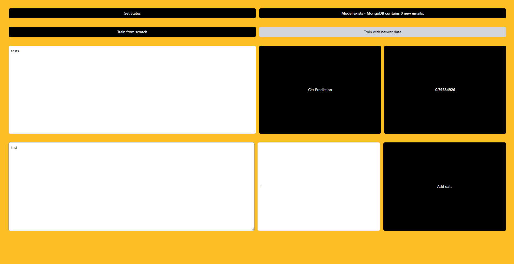

# Spam-classifier
This project is a production-ready, microservice driven, machine learning web application.
To deploy the services I used `docker-compose`. The different servies are:
- `front` the frontend, written in nextjs and tailwindcss
- `ml-api` the api for predictions
- `ml-train` the service responsible for training from scratch and continuing the training when new data comes in
- `api` the main api, reuniting all the api calls in nodeJS

### The Frontend:

You can get the status of the application up-top, which will tell you if a model exists and if new data exists. Their are also `retrain from scratch` and `continue training` buttons. Then you can actually get the predictions and at the bottom you can add new mails and label them.