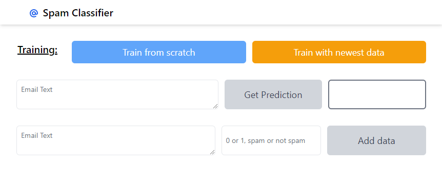
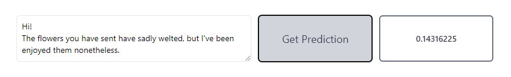
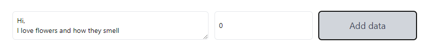

# Spam-classifier

This project is a production-ready, microservice driven, machine learning web application.
To deploy the services I used `docker-compose`. The different servies are:
- `front` the frontend, written in NextJS and TailwindCSS
- `ml` the API for predictions
- `ml-train` the service responsible for training from scratch and continuing the training when new data comes in
- `api` The main api which makes the `ml` and `ml-train` services accessible to the frontend.

The data is saved in a `mongodb` database.

## ML-Train

If the user requests to train the model, this service creates a new tensorflow model and trains it on the base dataset. It then saves the model data.

If the user requests to retrain the model on new data, this service loads the new mails and their labels from the `mongodb` database and loads the old model from disk. It then continues training on it.

## ML

On startup this service loads the model data from disk. It then uses it to create predictions.

It also has a `/reload` endpoint which is called by `ml-train` once the model has been changed.

## The Frontend:



The first time the application is started, the user has to press "Train from scratch" to train the model on the base dataset.

```
ml-train_1  | Model: "sequential"
ml-train_1  | _________________________________________________________________
ml-train_1  | Layer (type)                 Output Shape              Param #
ml-train_1  | =================================================================
ml-train_1  | embedding (Embedding)        (None, 20, 8)             16000
ml-train_1  | _________________________________________________________________
ml-train_1  | flatten (Flatten)            (None, 160)               0
ml-train_1  | _________________________________________________________________
ml-train_1  | dense (Dense)                (None, 1)                 161
ml-train_1  | =================================================================
ml-train_1  | Total params: 16,161
ml-train_1  | Trainable params: 16,161
ml-train_1  | Non-trainable params: 0
ml-train_1  | _________________________________________________________________
ml-train_1  | Epoch 1/10
75/75 [==============================] - 1s 6ms/step - loss: 0.6428 - acc: 0.7752 - val_loss: 0.4898 - val_acc: 0.8367
ml-train_1  | Epoch 2/10
75/75 [==============================] - 0s 1ms/step - loss: 0.4469 - acc: 0.8342 - val_loss: 0.3342 - val_acc: 0.8417
ml-train_1  | Epoch 3/10
75/75 [==============================] - 0s 1ms/step - loss: 0.3139 - acc: 0.8498 - val_loss: 0.2574 - val_acc: 0.8883
ml-train_1  | Epoch 4/10
75/75 [==============================] - 0s 969us/step - loss: 0.2424 - acc: 0.8853 - val_loss: 0.1980 - val_acc: 0.9183
ml-train_1  | Epoch 5/10
75/75 [==============================] - 0s 991us/step - loss: 0.1681 - acc: 0.9403 - val_loss: 0.1551 - val_acc: 0.9367
ml-train_1  | Epoch 6/10
75/75 [==============================] - 0s 959us/step - loss: 0.1296 - acc: 0.9489 - val_loss: 0.1277 - val_acc: 0.9533
ml-train_1  | Epoch 7/10
75/75 [==============================] - 0s 956us/step - loss: 0.1094 - acc: 0.9588 - val_loss: 0.1096 - val_acc: 0.9567
ml-train_1  | Epoch 8/10
75/75 [==============================] - 0s 968us/step - loss: 0.0952 - acc: 0.9639 - val_loss: 0.0975 - val_acc: 0.9617
```

Once the model is trained, the user can get a prediction on any email text they choose:



In this case, the email is classified as not spam. The probability that this is spam is 14% according to the model.

The user can also add labeled data. This would correspond to someone manually putting emails into their spam folder in gmail for example. First we add an example of a normal email and then we enter an example of a classic spam email.




Once the user has added data, they can press "Train with newest data". The machine learning service will then fetch the new data from the mongodb database and continue training the model on that data. The app doesn't stop working at any point, it will automatically replace and reload the model once the training is finished and the user experience will not be impacted at any point:

```
----> The app found two new emails as training data and adds them to the dataset:

Found:  {'_id': ObjectId('62f549e1a7f151b5b68c0846'), 'text': 'Hi,\nI love flowers and how they smell', 'label': 0, '__v': 0}
Found:  {'_id': ObjectId('62f54a0aa7f151e9a58c0847'), 'text': "Could you send me your credit-card, I need money, it's not a spam I swear!", 'label': 1, '__v': 0}

----> It then continues training the previous model on the newest dataset:

Epoch 1/10
1/1 [==============================] - 0s 362ms/step - loss: 0.4460 - acc: 1.0000 - val_loss: 2.1632 - val_acc: 0.0000e+00
...
```

